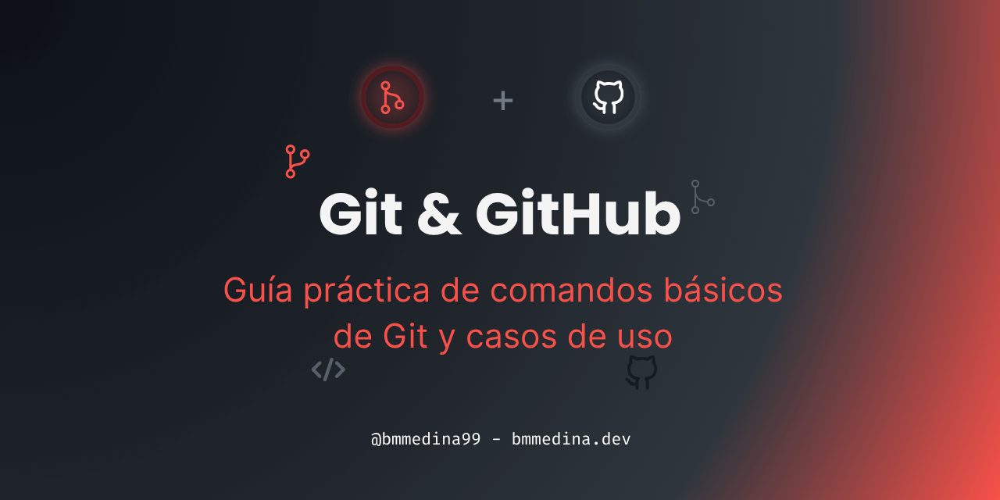

# ¿Qué es Git?

Cuando estamos creando un proyecto queremos mantenerlo seguro a los cambios y aquí es donde entra **Git** un **sistema de control de versiones distribuido**, guardando snapshots de tu código *(commits)* ayudando a comparar y revertir cambios sin perder historial.

>[!NOTE]
> **Snapshot** es el guardado de un estado de tu repositorio local en un momento específico, donde se encontrarían todos los archivos rastreados.

## Objetivo de esta guía

En esta guía, conocerás y aplicarás los **comandos básicos** y esenciales para gestionar **repositorios** con Git & GitHub, siguiendo buenas prácticas y un flujo de trabajo eficiente.

---

### Instalación y configuración inicial

#### Instalación

Para poder trabajar con **Git**, primero necesitas instalarlo en tu sistema. Puedes descargarlo desde la **[página oficial de Git](https://git-scm.com/download/)**. Para probar que lo tienes instalado, prueba a ejecutar el siguiente comando:

```sh
git --version
```

#### Configuración inicial

Antes de empezar a crear commits y ramas, debemos decirle a **Git** quién esta editando. Esto es de **mucha importancia**, ya que cada commit quedará registrado con tu nombre y correo identificando tu trabajo *(y otros colaboradores sabrán a quién felicitar... o **reclamar**)*

- **Tu nombre y correo:** Estos datos aparecerán en el historial de commits:

```sh
git config --global user.name "[tu_nombre]"
```
```sh
git config --global user.email "[tu_correo@ejemplo.com]"
```
> La flag *--global* afecta a todos los repositorios locales en tu máquina.

> [!TIP]
> Usa el mismo correo que tienes registrado en **GitHub**, así tu avatar aparecerá automáticamente en los commits.

**Para ver la configuración actual:**

```sh
git config --list
```
Si al comando anterior le agregas la flag `--global`, verás solo la configuración global:

```sh
git config --global --list
```

**Otras configuraciones (recomendadas):** Aunque no son obligatorias, estas opciones mejoran la experiencia con **Git**:

- **Cambiar el editor de texto:** Git necesita un editor de texto para mensajes de commits y merges. Configura `Visual Studio Code` como editor predeterminado:

```sh
git config --global core.editor "code --wait"
```
- **Configurar la rama principal:** Por defecto, Git usa `master` como nombre de la rama principal. Puedes cambiarlo a `production` u otro nombre que prefieras:

```sh
git config --global init.defaultBranch [nombre_rama]
```

- **Almacenar credenciales:** Si usas HTTPS para clonar repositorios, puedes configurar **Git** para que recuerde tus credenciales y no te las pida cada vez que hagas `push` o `pull`:

```sh
git config --global credential.helper store
```

---

### Empezando un proyecto con Git

Cuando comienzas un nuevo proyecto o te unes a uno existe, lo primero es **inicializar** el repositorio local y **enlazarlo** a un repositorio remoto.

1. **Crear un repositorio local**

```sh
git init
```
**Inicializa** el repositorio local en la carpeta actual. Esto genera un directorio oculto `.git/` donde se guardará todo el historial de tu proyecto.

2. **Enlazar a un repositorio remoto**

```sh
git remote add <remoto> <url_del_repositorio>
```
Una vez que tienes tu repo local, puedes enlazarlo a un **repositorio remoto** *(por ejemplo, en GitHub, GitLab, etc.)* para poder **subir** y **descargar** cambios.

**Flags útiles:**
- `git remote -v` → Muestra las URLs de los repositorios remotos enlazados *(fetch y push)*
- `git remote remove <remoto>` → Elimina el enlace al repositorio remoto.
- `git remote prune <remoto>` → Elimina referencias a ramas remotas que ya no existen.
- `git remote show <remoto>` → Muestra información detallada del remoto especificado.

> [!NOTE]
> El nombre más común para el **remoto** es `origin`, pero puedes otro nombre si manejas varios remotos *(por ejemplo, `upstream` o `fork`)*

3. **Clonar un proyecto existente**

```sh
git clone <url_del_repositorio>
```
Si el proyecto ya existe en un repositorio remoto, en lugar de `init` usarás `clone`. Esto crea una carpeta con el código, el historial y la conexión al remoto.

**Flags útiles:**
- `git clone --depth <n> <url_del_repositorio>` → Clona solo los últimos **n** commits.
- `git clone --branch <rama> <url_del_repositorio>` → Clona una rama específica.
- `git clone --single-branch <url_del_repositorio>` → Clona solo la rama por defecto sin otras ramas.

---

### Primer commit y seguimiento de archivos

Antes de guardar cambios, Git necesita saber **qué archivos han cambiado** y cuáles quieres incluir en el siguiente **commit** *(guardado de cambios)*

4. **Ver el estado del repositorio**

```sh
git status
```
Muestra el estado actual del repositorio local, qué archivos están **modificados**, **agregados**, **eliminados** o **sin seguimiento** *(untracked)*.

**Flags útiles:**
- `git status -s` → Muestra el estado en formato compacto.
  - **`M`**: Modificado | **`A`**: Agregado *(staged)* | **`D`**: Eliminado | **`??`**: Sin seguimiento *(untracked)*
- `git status -b` → Muestra información de la rama actual.

5. **Agregar archivos al área de preparación (staging area)**

```sh
git add <archivo>
```
Agrega un archivo específico al área de preparación *(staging area)*, indicando que formará parte del próximo commit.

**Flags útiles:**
- `git add .` → Agrega todos los cambios, **incluyendo** archivos nuevos.
- `git add -u` → Agrega solo archivos modificados y eliminados, **excluyendo** archivos nuevos.

6. **Quitar archivos del área de preparación (staging area)**

```sh
git restore <archivo>
```
Restaura los cambios realizados a un archivo específico en el área de preparación *(staging area)*, quitándolo de la lista de archivos que serán incluidos en el próximo commit.

**Flags útiles:**
- `git restore .` → Restaura todos los archivos modificados.
- `git restore --staged <archivo` → Agrega solo archivos modificados y eliminados, **excluyendo** archivos nuevos.

7. **Guardar los cambios con un commit**

```sh
git commit
```
Guarda los cambios del área de preparación *(staging area)* en el repositorio local con un mensaje descriptivo.

> [!NOTE]
> Como una **recomendación** echa un vistazo al estándar de **[Conventional Commits](https://www.conventionalcommits.org/es/)** para que los mensajes sean más claros.

**Flags útiles:**
- `git commit -m “<mensaje>”` → Crea un commit con el mensaje especificado directamente en la línea de comandos.
- `git commit --amend` → Modifica el último commit, útil para corregir mensajes o agregar archivos olvidados.
- `git commit --amend --no-edit` → Modifica el último commit sin cambiar el mensaje.

8. **Ver el historial de commits**

```sh
git log
```
Muestra el historial de commits de la rama actual.

**Flags útiles:**
- `git log -n <nº>` → Muestra solo los últimos **nº** commits.
- `git log --oneline` → Muestra cada commit en una línea.
- `git log --graph` → Muestra el historial en forma de gráfico.
- `git log --all` → Muestra el commit de todas las ramas.
- `git log --stat` → Muestra estadísticas de los archivos modificados.
- `git log --author=<nombre>` → Muestra únicamente los commits del autor especificado.

> [!TIP]
> Puedes combinar varias flags para personalizar la salida del historial, la combinación más popular es:
> `git log --oneline --graph --all`

---

### Trabajando con ramas

Cuando tienes en mente una nueva idea o alguna correción, es buena práctica crear una **rama nueva** para trabajar en esos cambios sin afectar la rama principal.

9. Listar y gestionar ramas

```sh
git branch
```
**Muestra** las ramas locales existentes e indica en que rama te **encuentras** actualmente.

**Flags útiles:**
- `git branch <nombre>` → Crea una nueva rama local.
- `git branch -m <nombre_nuevo>` → Renombra la rama actual.
- `git branch -m <viejo> <nuevo>` → Renombra una rama especificada.
- `git branch -d <nombre>` → Elimina una rama (solo si está fusionada)
- `git branch -D <nombre>` → Fuerza la eliminación de una rama local.
- `git branch -r` → Muestra solo las ramas remotas.
- `git branch -v` → Muestra el último commit de cada rama.

> [!TIP]
> Usa esta flag extra `git branch --set-upstream-to=<remoto>/<rama_remota> <rama_local>`, para establecer una rama remota como seguimiento de una rama local.

10.  Cambiar entre ramas *(forma moderna)*

```sh
git switch <rama>
```
Cambia a una rama existente en tu repositorio local.

**Flags útiles:**
- `git switch -` → Cambia a la rama anterior en la que estabas trabajando.
- `git switch -c <rama>` → Crea y cambia a una nueva rama.

11.  Comando legacy, pero multiuso

```sh
git checkout
```
Comando multiuso que antes usaba para todo, pero ahora se recomienda usar `git switch` para cambiar ramas y `git restore` para restaurar archivos.

**Flags útiles:**
- `git checkout <rama>` → Cambia de rama.
- `git checkout -b <nombre_rama>` → Crea y cambia a una nueva rama.
- `git checkout -` → Cambia a la rama anterior. Equivalente a `git switch -`.
- `git checkout -- <archivo>` → Descarta cambios en un archivo *(obsoleto, usar `git restore`)*

---

### Sincronizando y colaboración con repositorios remoto

12. Descargar cambios sin aplicarlos

```sh
git fetch
```
Descarga los últimos cambios del repositorio remoto por defecto *(origin)*, pero **no los aplica** automáticamente a tu rama actual. Esto te permite revisar los cambios antes de integrarlos.

**Flags útiles:**
- `git fetch <remoto>` → Descarga cambios de un remoto específico.
- `git fetch <remoto> <rama>` → Descarga cambios de una rama específica del remoto.
- `git fetch --prune` → Elimina referencias a ramas remotas que ya no existen.
- `git fetch --dry-run` → Simula el fetch sin descargar nada, mostrando qué cambios se descargarían.

13.  Fusionar cambios descargados

```sh
git merge <rama>
```
Fusiona los cambios de otra rama con tu rama actual. Usualmente se usa después de `git fetch` para integrar los cambios descargados.

**Flags útiles:**
- `git merge --no-ff <rama>` → Fuerza un merge commit incluso si es posible un *fast-forward*.
- `git merge --ff-only <rama>` → Solo permite *fast-forward*, fallando si no es posible.
- `git merge --abort` → Cancela la fusión en curso si hay conflictos.
- `git merge --continue` → Continúa una fusión después de resolver conflictos.
- `git merge --squash <rama>` → Fusiona los cambios de la rama especificada en un solo commit sin crear un merge commit.

> [!NOTE]
> El *fast-forward* ocurre cuando la rama actual puede avanzar directamente a la punta de la otra rama sin necesidad de un commit de fusión.

14. Descargar y fusionar en un solo paso

```sh
git pull
```
Descarga los cambios del remoto y los fusiona automáticamente con tu rama actual. Es una combinación de `git fetch` seguido de `git merge`. **Úsalo cuando confíes en que no habrá conflictos**.

**Flags útiles:**
- `git pull <remoto> <rama>` → Descarga y fusiona una rama específica de un remoto específico.
- `git pull --rebase` → Usa rebase en lugar de merge para integrar los cambios.
- `git pull --ff-only` → Solo permite *fast-forward*, fallando si no es posible.
- `git pull --prune` → Elimina referencias a ramas remotas que ya no existen.

15. Subir cambios al repositorio remoto

```sh
git push
```
Sube los commits de tu rama local al repositorio remoto asociado.

**Flags útiles:**
- `git push <remoto> <rama>` → Sube los commits a un remoto y rama específicos.
- `git push -u <remoto> <rama>` → Sube los commits y establece la rama remota como seguimiento de la rama local.
- `git push --force` → Fuerza el push, sobrescribiendo los cambios en el remoto *(usar con precaución)*.
- `git push --force-with-lease` → Fuerza el push de forma segura, solo si no hay cambios nuevos en el remoto.
- `git push --dry-run` → Simula el push sin subir nada, mostrando qué cambios se subirían.

> [!WARNING]
> El comando de `git push --force` debe usarse con extrema precaución, ya que puede sobrescribir los cambios en el repositorio remoto y causar pérdida de datos para otros colaboradores. Usalo en ramas personales que solo tú uses.

---

<h3>Resolución de problemas y revisión del historial</h3>

```sh
git diff <archivo>
```
**Muestra** los cambios del archivo especificado, entre el **estado actual** y los cambios que aún no han sido **confirmados**.

- **Flags útiles:**
  - **`git diff <hash-commit1> <hash-commit2>` →** **Compara** las diferencias entre dos **commits especificados**.
  - **`git diff --name-only` →** Muestra **solamente** el nombre de los archivos **modificados**.
  - **`git diff --stat` →** Muestra un resumen **estadístico** de los cambios.

```sh
git reset <archivo>
```
**Deshace** los cambios no confirmados en un archivo, **restaurándolo** al estado del último commit.

- **Flags útiles:**
  - **`git reset --soft <hash-commit>` →** **Restablece** el puntero *(HEAD)* al commit especificado, pero **mantiene todos los cambios** en el área de preparación *(staging area)*.
  - **`git reset --mixed <hash-commit>` →** **Restablece** el puntero *(HEAD)* al commit especificado, **elimina los cambios** en el área de preparación *(staging area)*, pero **mantiene los cambios locales**.
  - **`git reset --hard <hash-commit>` →** **Restablece completamente** el puntero *(HEAD)* al commit especificado **eliminando completamente todo los cambios**.

> [!CAUTION]
> El uso del flag **--hard** debe hacerse con extrema precaución dado que eliminará permanentemente todos los cambios no confirmados en el área de trabajo y el área de preparación.
